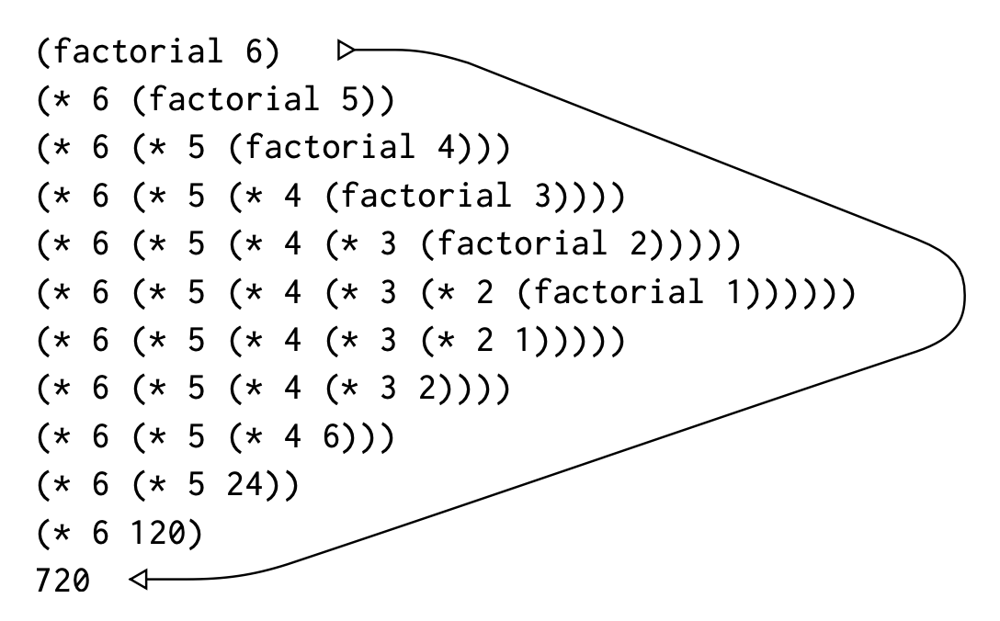
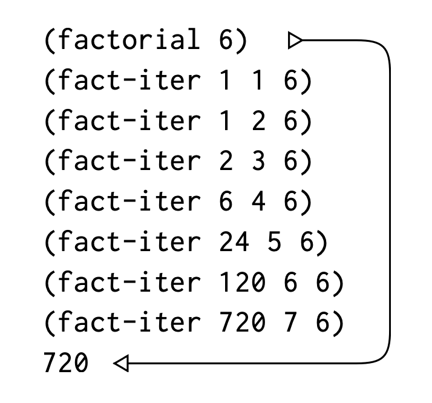
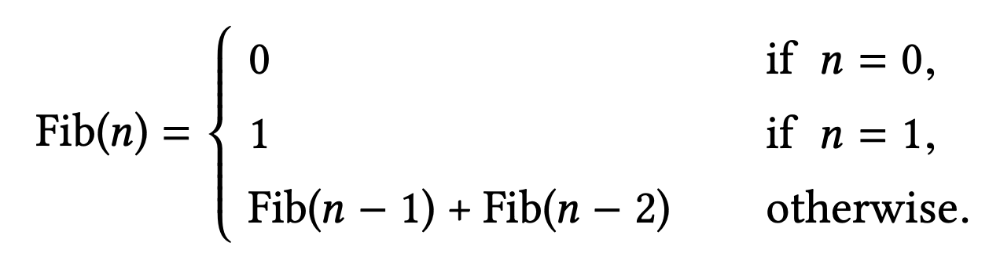

> 번역서를 중점으로 보고 있습니다. 번역서에서 이해하기 어려운 말은 원서에서도 같이 참고하고 있습니다.

프로그래밍을 장기에 빗대서 표현하면 앞장에서는 어떻게 보면 장기 말이 무엇인지 어떻게 움직일 수 있는 건지에 대해서 배웠다.

장기에 대해서 알았다고 장기를 잘하는 것은 아니다. 우리는 장기를 두기 위해 전략과 전술을 펼쳐야 한다. 어떤 말을 움직이는 게 얼마 만큼의 가치가 있는지, 어떤 결과가 나올지 미리 예측을 하는 경험이 필요하다.

프로그램을 짜는 일도 마찬가지다. 우리가 무슨 이유로 무엇을 위해서 어떻게 만드는지 알아야 한다.

Procedure는 계산 과정이 그 내부에서 어떻게 단계별로 전개가 될지 정의하는 것이다.

## Linear Recursion and Iteration

우선, `factorial`에 대해서 알아보자.

Factorial은 다음과 같이 정의할 수 있다.

> n!= n·(n−1)·(n−2)···3·2·1

Factorial을 계산하는 방법은 많다. 그 중 하나는 `n!`은 `n * (n-1)!`을 이용하는 것이다.

> n!= n·[(n−1)·(n−2)···3·2·1]= n·(n−1)!

따라서 우리는 이를 다음과 같은 procedure로 나타낼 수 있다.

```scheme
(define (factorial n)
  (if (= n 1)
    1
    (* n (factorial (- n 1)))))
```

이는 다음과 같이 동작할 수 있다.



우리가 앞서 소개한 recursive하게 자기 자신을 정의하면서 body에 그 procedure를 사용하고 있다. 이것을 보고 recursive하게 동작한다고 할 수 있다. recursive의 특징 중 하나는 위 동작처럼 자라나고 줄어드는 특징이 있다.

Factorial을 구하는 다른 방법을 알아보자.

`n!`은 1에 2를 곱한 값에 다시 3, 4를 차례로 곱하면서 n에 도달할 때까지 그 과정을 계속 되풀이하는 것이다.

지금까지 곱한 값을 `product`라 놓고 1부터 `n`까지 탐색하는 변수를 `counter`라고 두고, 그 단계를 지날 때마다 `counter`와 `product`를 아래 규칙에 따라 바꿀 수 있다.

```markdown
product = counter \* product
counter = counter + 1
```

counter가 n에 도달할 때 결국 product 값은 `n!`이 될 수 있다. 이를 procedure로 표현하면 아래와 같다.

```scheme
(define (factorial n)
  (fact-iter 1 1 n))

(define (fact-iter product counter max-count)
  (if (> counter max-count)
      product
      (fact-iter (* counter product)
                 (+ counter 1)
                 max-count)))
```

이는 다음처럼 동작한다.



이것은 iterative하게 동작한다고 할 수 있다. 즉, 반복하는 프로세스를 가졌는데 우리는 내부에 `counter`, `max-count`라는 state를 관리하는 변수를 줘서 조건을 따질 수 있다. recursive와는 다르게 자라나고 줄어드는 과정은 없다.

## Tree Recursion

또 다른 흔하디 흔한 계산 방식 중 하나는 *tree recursion*이다.

예를 들어, 다음과 같이 피보나치 수열을 계산하는 걸 생각해보자.

> 0, 1, 1, 2, 3, 5, 8, 13, 21, ...

일반적으로 피보나치 수열은 다음과 같이 정의할 수 있다.



우리는 바로 recursive procedure로 만들 수 있다.

```scheme
(define (fib n)
  (cond ((= n 0) 0)
        ((= n 1) 1)
        (else (+ (fib (- n 1))
                 (fib (- n 2))))))
```

위 procedure대로 (fib 5)를 구하기 위해 실행하면 어떻게 되는지 살펴보자.


`fib` procedure의 정의대로 `(fib 5)`를 구하기 위해서는 `(fib 4)`와 `(fib 3)`를 구해야 하고, `(fib 4)`를 구하기 위해서는 `(fib 3)`와 `(fib 2)`를 구해야 한다. 위처럼 나뭇가지 혹은 뿌리처럼 갈래로 펼쳐진 꼴을 tree 구조라 한다.

`fib` procedure는 현재 단계마다 갈래가 2개씩 갈라져 나온다.

현재 피보나치 procedure는 `(fib 5)`를 구하기 위해 `(fib 3)`, `(fib 2)`, `(fib 1)`, `(fib 0)`을 중복으로 호출하고 있다.

같은 값을 가지는 계산을 반복적으로 하기 때문에 위 방법은 사실 좋지 않은 방법이다.

다음처럼 피보나치 수열을 iterative 프로세스로 바꿀 수 있다.

정수 a, b가 있다고 하면, 첫 값은 차례로 Fib(1) = 1과 Fib(0) = 0으로 놓고, 되풀이할 때마다 아래 규칙에 따라 값을 바꿀 수 있다.

```markdown
a = a + b
b = a
```

이를 반복하면 결국 a와 b가 Fib(n + 1), Fib(n)이 되는데 이 규칙을 다음과 같이 procedure로 작성해보자.

```scheme
(define (fib n)
  (fib-iter 1 0 n))

(define (fib-iter a b count)
  (if (= count 0)
      b
      (fib-iter (+ a b) a (- count 1))))
```

위 방법은 linear recursive하게 Fib(n) 값을 구하는 방법이다. 아래와 같이 동작할 수 있다.

```scheme
(fib 5)
>
(fib-tier 1 0 5)
(fib-iter 1 1 4)
(fib-iter 2 1 3)
(fib-iter 3 2 2)
(fib-iter 5 3 1)
(fib-iter 8 5 0)
>
5
```

여기서 본 tree recursion으로 이걸 쓸모 없다고 판단해서는 안된다. 여러 계층을 가진 구조화된 데이터를 다루는 프로세스에서는 또 잘 맞을 경우도 있기 때문이다.

물론, 앞서 만든 `fib` procedure의 경우 처음 만든 게 성능이 훨씬 떨어지지만 수학적인 정의를 그대로 옮긴 것처럼 그 정의를 쉽게 파악할 수 있는 장점 또한 있다.

## Orders of Growth

앞서 나온 문제를 볼 때 어떤 계산 과정을 가지고냐에 따라 사용하는 resource의 크기가 달라진다. 이 차이를 비교하고 싶을 때 사용하는 간편한 방법 중 하나는 *order of growth*라는 개념을 사용하여 input의 크기에 따라 resource의 늘어나는 사용량을 측정할 수 있다.

어떤 문제의 크기를 나타내는 `n`이라는 변수가 있다고 하자. 그리고 `R(n)`은 크기가 n인 문제를 해결하는 데 필요한 자원의 양을 의미한다.

한 번에 고정된 수의 연산만 수행할 수 있는 컴퓨터에서는 실행 시간은 기본적인 연산 횟수에 비례한다.

우리는 `R(n)`의 증가 속도를 분석할 때 `Θ(f(n))` 표기법(세타 표기법)을 사용한다.

> R(n)=Θ(f(n))

결국, Θ(세타) 표기법은 어떤 함수의 성장 속도를 분석할 때 사용하는 개념이다.

만약 어떤 알고리즘이 입력 크기 n이 커질수록 대략 2n^2만큼 시간이 걸린다면, 우리는 `R(n) = Θ(n^2)` 라고 쓴다.

만약 실행 시간이 대략 5n + 10이라면 `R(n) = Θ(n)` 큰 수에서는 상수 10이 의미가 없고, 주된 성장 속도를 결정하는 것은 n이므로 이와 같이 표기할 수 있다.

> 한 마디로 입력 크기가 달라질 때 걸리는 시간의 패턴을 보는 것이다. 알고리즘을 평가하는 중요한 개념이므로 잘 알아두면 좋다.

앞서 살펴본 factorial의 두 케이스를 예로 들어보자.

Recursive하게 만든 procedure에서는 계산 단계가 `n`에 비례하여 늘어났다. 이 프로세스가 거쳐야 할 단계는 따라서 `Θ(n)`만큼 늘어나고, 계산에 필요한 기억 공간도 `Θ(n)`으로 늘어났다.

Iterative하게 만든 procedure의 경우, 그 계산 단계가 `n`에 비례하여 `Θ(n)`만큼 늘어난 건 동일하지만 필요한 기억 공간의 경우 `Θ(1)`로 고정적이다.

## 정리

1. **재귀(Recursion)**: 문제를 작은 조각으로 나누고 반복 호출.

- 예: `(define (factorial n) (if (= n 1) 1 (* n (factorial (- n 1)))))`.

2. **선형 재귀 vs 반복**: 메모리를 쌓는 재귀 vs 꼬리 재귀(tail recursion)로 반복처럼.

- 예: `(define (fact-iter n acc) (if (= n 1) acc (fact-iter (- n 1) (* n acc))))`.

3. **트리 재귀**: 여러 갈래로 뻗는 재귀(비효율적).

- 예: `(fib n) → (fib (- n 1)) + (fib (- n 2))`.

4. **복잡도**: 시간(O(n))과 공간 사용 분석.

정의: 프로시저는 단순 호출을 넘어, 실행 과정(재귀, 반복)을 설계한다.
