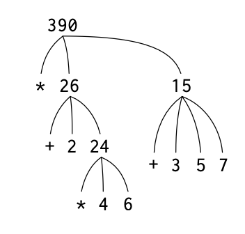
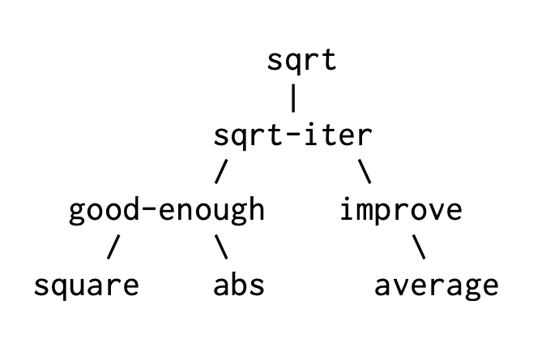

> SICP 원문에서 독자에게 이해시키고자 하는 개념을 최대한 살리고자 모든 단어를 번역하지 않았습니다. 어려운 단어는 구글링 하시면 금방 이해하실 수 있을 거라고 생각합니다.

A **powerful** programming language는 컴퓨터에게 명령하는 수단 그 이상의 의미를 가진다. 프로그래밍 언어라는 것은 우리가 명령하는 그 과정에 대한 아이디어들을 하나로 조합해주는 일종의 `Framework`로의 역할을 하기도 한다. 따라서 우리가 어떤 프로그래밍 언어를 설명할 때는, 해당 언어가 단순한 것들을 합쳐 더욱 복잡한 것을 형성하는 그러한 방법(Abstraction)을 어떻게 제공하는지 주목해야할 필요가 있다.

우리가 **powerful**하다고 부를 수 있는 language에는 다음 세 가지의 메커니즘을 가지고 있다.

- **primitive expressions**: 언어에서 다루는 가장 단순한 개념을 나타내는 것
- **means of combination**: 단순한 요소(element)들을 조합하여 복합적인 요소를 구성하는 방법을 제공하는 것
- **means of abstraction**: 만들어진 복합적인 요소에 이름을 부여할 수 있고, 그것을 하나의 단위로 다룰 수 있게 제공하는 것

프로그래밍에서는 두 종류의 요소를 다룬다. 하나는 `procedures`와 다른 하나는 `data`이다(나중 가면 둘이 크게 별반 다르지 않다는 것을 알 수 있음). data는 말 그대로 데이터 혹은 그냥 어떠한 것이라고 표현할 수 있다. procedure는 data를 조작할 수 있게 규칙을 설명해주는 것이다.

결국 프로그래밍 언어라는 것은 `primitive data`와 `primitive procedure`을 설명할 수 있고, 이걸 combining 하거나 abstracting 할 수 있는 방법을 제공해주면 되는 것이다.

## Expressions

> Lisp의 dialect인 `Scheme`에 대해서 일부 표현 방식을 설명

```scheme
(+ 137 349)
486

(/ 10 5)
2

(+ 2.7 10)
12.7
```

표현식(Expression)이란 이런 것들이다. 여기서는 괄호 안의 맨 왼쪽 요소에는 *operator*가 위치해 있고 그 오른쪽에 나머지 요소들이 *operand*들이 위치해있다. 이것을 조합식(Combination)이라고 한다. Scheme에서는 operator가 맨 왼쪽으로 가는 _prefix notation_ 방식(Convention)을 따른다.

```scheme
(+ 21 35 12 7)
75

(+ (* 3 5) (- 10 6))
19
```

prefix notation으로 작성하면 모호함이 전혀 없고, *nested*하게 작성해도 바로 이해하기 쉬운 장점이 있다.

## Naming and the Environment

```scheme
(define size 2)
```

이는 변수(variable)를 사용하는 방법이다.

프로그래밍 언어의 가장 중요한 점 중 하나는 이렇게 이름을 정해서 computational objects에 가리킬 수 있게 해주는 것이다.

예제:

```scheme
(define pi 3.14159)
(define radius 10)

(* pi (* radius radius))
314.159

(define circumference (* 2 pi radius))

circumference
62.8318
```

위에서 살펴본 `define`은 이 언어의 가장 기본적인 추상화의 한 방법이다. 우리가 선언한 변수(pi, radius, circumference)는 memory에 유지되는데 이걸 *environment*라고 부른다.(정확히는 *global environment*라고 부름)

## Evaluating Combinations

조합식을 평가(즉, 계산하는)하는 방법은 다음 과정을 따른다.

```scheme
(+ 21 35 12 7)
75
```

1. 조합식의 subexpressions을 계산한다.
2. 가장 왼쪽의 subexpression인 operator를 가지고 오른쪽에 있는 subexpressions인 operands에 procedure를 수행한다.

조금 더 복잡한 식으로 가보자.

```scheme
(* (+ 2 (* 4 6)) (+ 3 5 7))
390
```

위 식은 어떻게 계산이 될까?



위 식은 총 4개의 조합식이 계산되어야 한다. 이 과정을 트리 구조로 표현하면서 얻을 수 있다. 보면서 아마 트리 같은 계층적인 구조에 *recursion*이 강력한 기술이라는 걸 알게 될 수 있다.

## Compound Procedures

이제 우리는 `procedure`가 뭔지 알아볼 것이다. 이는 복합적인 연산에 이름을 붙이고 이를 하나의 단위로 사용할 수 있게 하는 아주 강력한 추상화 기법이다. (근데 사실 이미 function이라는 아름으로 우리는 쉽게 바로 이해할 수 있음)

???: 제곱을 하기 위해서는 그 수를 서로 곱하세요!

```scheme
(define (square x) (* x x))
```

이렇게 표현할 수 있다. 우리는 이 compound procedure에 square라는 이름을 붙여줬다. 이 procedure를 다음과 같이 사용할 수 있다.

```scheme
(square 21)
441

(square (+ 2 5))
49

(square (square 3))
81
```

또 다음과 같이 사용할 수도 있다.

```scheme
(+ (square x) (square y))
```

위는 x^2 + y^2를 표현한 식이다. `sum-of-squares`라는 procedure를 하나 더 만들어보자.

```scheme
(define (sum-of-squares x y)
  (+ (square x) (square y)))

(sum-of-squares 3 4)
25
```

이렇게 x^2 + y^2를 `sum-of-squares`로 정의해줄 수 있다. 한 단계 나아가서 다음과 같은 procedure를 만들고 살펴보자.

```scheme
(define (f a)
  (sum-of-squares (+ a 1) (* a 2)))

(f 5)
136
```

Compound procedures는 위에서 앞서 살펴본 +, *와 같은 primitive procedure와 동일하게 사용하면 된다. 정말 누군가 `sum-of-squares`를 보고 +, *와 같은 이런 사칙연산처럼 이미 내장되어있는지 알 수 없다.

## The Substitution Model for Procedure Application

이 코드를 실행하는 `interpreter`는 다음처럼 동작한다고 추측할 수 있다.

```scheme
(f 5)

> f의 body는 아래와 같다.

(sum-of-squares (+ a 1) (* a 2))

> a에 5를 대입한다.

(sum-of-squares (+ 5 1) (* 5 2))
```

우리는 이렇게 `sum-of-squares`라는 operator와 `(+ 5 1)`, `(* 5 2)`라는 operands가 남았다.

```scheme
(+ (square 6) (square 10))

> square의 정의를 통해 다음으로 바꿀 수 있다.

(+ (* 6 6) (* 10 10))

> 이는 다음과 같이 계산될 수 있다.

(+ 36 100)

> 그리고 마지막으로

136
```

이러한 과정들을 _substitution model_ for procedure application이라고 부른다.

## Applicative Order vs. Normal Order

위에서 우리는 먼저 operator와 operands를 이용하여 계산을 하고, 그 값을 그 다음 procedure에 대입하여 계산을 했다. 이 계산 방법은 Applicative Order라고 부른다. 다만, 계산 방식에는 이것만이 있는 것이 아니다.

다른 방법으로는 operands를 필요하기 전까지 계산하지 않고 마지막에 계산하는 방식이 있다.(아래 예제를 보는 게 더 빠르다.) 아래는 Applicative Order와 Normal Order가 어떻게 다른지 간단한 식이 주어진다.

### Applicative Order

```scheme
(sum-of-squares (+ 5 1) (* 5 2))
>
(sum-of-squares 6 10)
>
(+ (square 6) (square 10))
>
(+ (* 6 6) (* 10 10))
>
(+ 36 100)
>
136
```

### Normal Order

```scheme
(sum-of-squares (+ 5 1) (* 5 2))
>
(+ (square (+ 5 1)) (square (* 5 2)))
>
(+ (* (+ 5 1) (+ 5 1)) (* (* 5 2) (* 5 2)))
>
(+ (* 6 6) (* 10 10))
>
(+ 36 100)
>
136
```

이게 바로 Normal Order 방식이다. 결과는 이전 evaluation model인 applicative order와 동일한 결과를 준다. 하지만 보다시피 `(+ 5 1)`, `(* 5 2)` 이 계산이 두 번 반복됐다.

Applicative Order의 경우 Eager Evaluation(즉시 평가) 방식이 사용돠고, Normal Order의 경우 Lazy Evaluation(지연 평가) 방식이 사용된다.

```python
def heavy_computation():
    print("Computing...")
    return 42

def applicative_example(x):
    return x + x

print(applicative_example(heavy_computation()))
```

조금 더 친숙한 위 파이썬 코드를 살펴보자. Applicative Order은 어떻게 동작할까?

```python
# 1. heavy_computation()을 먼저 실행 → "Computing..." 출력
# 2. 결과값 42를 x에 대입
# 3. x + x → 42 + 42 = 84

print(applicative_example(heavy_computation()))
>
Computing...
>
print(applicative_example(42))
>
print(42 + 42)
>
print(84)
>
84
```

반면에 Normal Order은 어떻게 동작할까?

```python
print(applicative_example(heavy_computation()))
>
print(heavy_computation() + heavy_computation())
>
Computing...
Computing...
>
print(42 + 42)
>
print(84)
>
84
```

예상할 수 있듯이 Normal Order은 Applicative Order에 비해 느리다. 대부분의 현대 언어에서는 함수에 대해서 Applicative Order를 사용하고 있다.

다만, Lazy Evaluation에 대해서는 느리다고 버릴 이유가 없다. 이미 중요한 곳에서 많이 활용되고 있다.

예를 들면, `if (a || b)` 같은 조건문이 있다고 보자. 여기서 a가 충족되면 b는 살펴볼 필요도 없다. 이런 게 Lazy Evalutation이다.

## Conditional Expressions and Predicates

다른 언어와 같은 조건문, 논리 연산 파트이다. 아래 예제를 보고 빠르게 넘어가자.

```scheme
(define (abs x)
  (cond ((> x 0) x)
  ((= x 0) 0)
  ((< x 0) (- x))))
```

```scheme
(define (abs x)
  (cond ((< x 0) (- x))
  (else x)))
```

```scheme
(define (abs x)
  (if (< x 0)
    (- x)
  x))
```

```scheme
(and (> x 5) (< x 10))
```

```scheme
(define (>= x y) (or (> x y) (= x y)))
```

```scheme
(define (>= x y) (not (< x y)))
```

문법을 설명하고자 글을 쓰는 것은 아니니 알아서 이해하면 좋겠다..

## Example: Square Roots by Newton’s Method

앞서 설명한 Procedures는 일반적인 수학에서 사용하는 함수와 비슷하다. 하나 이상의 parameters로 값을 계산하고 결과를 받아온다. 하지만, 수학에서의 functions와 computer procedures에는 중요한 차이가 있다. 다음을 같이 보자.

Square root 함수의 수학적 정의는 다음과 같이 내릴 수 있다.

> √x = the y such that y ≥0 and y^2 = x .

위는 수학에서 sqaure root 함수에 대한 정의다. 하지만 procedure에서 가장 중요한 **과정**을 설명하지 않는다.

이는 수학적 함수 정의는 what에 집중한 declarative descriptions인 것이고, procedure에서는 그 과정(how to)을 위한 imperative descriptions가 필요하다.

그래서 컴퓨터는 square root를 어떻게 계산할까? 가장 common한 방법으로는 Newton’s method of successive approximations를 이용하는 것이다. Newton-Raphson Method로도 유명하다.

…

2의 제곱근을 구하는 방법

```markdown
Guess Quotient Average
1 (2/1) = 2 ((2 + 1)/2) = 1.5
1.5 (2/1.5) = 1.3333 ((1.3333 + 1.5)/2) = 1.4167
1.4167 (2/1.4167) = 1.4118 ((1.4167 + 1.4118)/2) = 1.4142
1.4142 ... ...
```

이런 과정을 하다보면 2의 제곱근에 가까운 값을 구할 수 있다. 이 과정을 Procedure로 나타내보자.

구하려고 하는 radicand x(여기서는 2)와 그 결과값 guess를 가지고 계산한다. guess가 충분하다면 계산을 끝내고, 아니면 그 과정을 반복하면 된다. 우선, 간단한 계산을 시작해보자.

```scheme
(define (sqrt-iter guess x)
  (if (good-enough? guess x)
    guess
    (sqrt-iter (improve guess x)
               x)))
```

guess 값과 x를 guess로 나눈 값의 평균(/ x guess)을 내서 제곱근에 더 가까운 값을 계산할 수 있다.

```scheme
(define (average x y)
  (/ (+ x y) 2))

(define (improve guess x)
  (average guess (/ x guess)))
```

우리가 *good enough*하게 판단할 수 있는 정도도 정해야 한다.

```scheme
(define (good-enough? guess x)
  (< (abs (- (square guess) x)) 0.001))
```

이는 제곱근의 오차가 0.001을 넘지 않을 때까지 근사값을 찾는 것이다. 마지막으로 이 값을 계산하는 프로시저를 만들면 된다. 우선, 제곱근에 가까운 값(guess)은 1을 쓰기로 하자.

```scheme
(define (sqrt x)
  (sqrt-iter 1.0 x))
```

한번 돌려볼까요?

```scheme
(sqrt 9)
3.00009155413138

(sqrt (+ 100 37))
11.704699917758145

(sqrt (+ (sqrt 2) (sqrt 3)))
1.7739279023207892

(square (sqrt 1000))
1000.000369924366
```

## Procedures as Black-Box Abstractions

우리는 `sqrt-iter`를 _recursive_(재귀)하게 만들었다. procedure을 정의하면서 자기 자신을 사용하도록 만든 것이다.



`sqrt`는 위 그림과 같이 문제를 작게 나누어 procedure을 여러개 구성하고 하나로 다시 구성했다.

Procedure을 나누고 구성할 때는 단순히 작은 조각으로 나누는 것이 아니다. 이후에는 이보다 더욱 크고 다양한 동작을 하는 하나의 프로그램으로 만들 때를 고려하기 위해 각 procedure가 어떤 일을 하는지 명확히 할 필요가 있고, 결국 그게 잘 만들어진 `module`이 될 것이다.

우리는 `square`을 만들 때 값을 **어떻게** 구하는지는 몰라도 어쨌든 제곱값을 내놓는다는 걸 안다. 이것은 결국 블랙바스와도 같은 것이다.

### Local names

procedure을 만들 때는 그걸 사용하는 사용자에게 아무런 영향이 없어야 한다. 다음 두 procedure는 구분할 수 없다.(= 똑같다)

```scheme
(define (square x) (* x x))
(define (square y) (* y y))
```

procedure의 prarmeter 이름이 독립적이어야 한다. (번역서: 프로시저의 매개변수 이름이 프로시저가 뜻하는 바에 영향을 주지 않아야 한다.)

> 원서나 번역서나 곧바로 이 뜻을 이해하기 어렵다.

결국 이것이 뜻하는 의미는 parameter는 해당 procedure에 종속되어 있다. 혹은 local variable로 사용되어야 한다는 의미다.

> 이게 functional programming의 중요한 원칙 중 하나로 알고 있다. procedure 자체가 외부 어느 곳에도 영향을 줄 수 없으며(no side-effects), 그 자체 하나로 **Pure Function**이다.

### Internal definitions and block structure

우리는 지금까지 프로시저를 다 따로따로 정의해왔다.

```scheme
(define (sqrt x)
  (sqrt-iter 1.0 x)

(define (sqrt-iter guess x)
  (if (good-enough? guess x)
    guess
    (sqrt-iter (improve guess x) x)))

(define (good-enough? guess x)
  (< (abs (- (square guess) x)) 0.001))

(define (improve guess x)
  (average guess (/ x guess)))
```

다만, 이 procedure를 사용하는 쪽에서는 `sqrt` 이것만 있으면 된다. `sqrt-iter`, `good-enough?`, `improve`는 `sqrt`를 사용하는 입장에서 헷갈리게 만든다. 그리고 새롭게 `sqrt-iter`, ~~등의 프로시저를 새롭게 만들고 싶을 때에 이미 있기 때문에 만들어 쓸 수 없다. `sqrt`에서 이미 사용하고 있기 때문이다.

그래서 우리는 이를 숨길 수 있어야 한다. 바로 `sqrt` 안에 숨겨서 말이다.

```scheme
define (sqrt x)
  (define (good-enough? guess)
    (< (abs (- (square guess) x)) 0.001))
  (define (improve guess)
    (average guess (/ x guess)))
  (define (sqrt-iter guess)
    (if (good-enough? guess)
      guess
      (sqrt-iter (improve guess))))
  (sqrt-iter 1.0))
```

이렇게 procedure의 definition을 nested한 걸 *block structure*라고 부른다. 그리고 사실 이전에 만든 procedure와 달리 define에서 `x`를 다 제거했는데 이는 `sqrt`에서 들어온 `x`를 바로 그 하위 procedure의 body 안에서 binding 할 수 있기 때문이다. 이를 *lexical scoping*이라고 부를 수 있다.

## 정리

1. **기본 표현식**: 숫자, 연산자(`+`, `*`), 변수 정의(`define`).

- 예: `(define x 10)`, `(+ 3 4)`.

2. **프로시저 정의**: 함수를 만들고 호출.

- 예: `(define (square x) (* x x))`.

3. **치환 모델(Substitution Model)**: 함수 호출이 어떻게 계산되는지.

- `(square 3)` → `(* 3 3)` → `9`.

4. **조건과 논리**: (if), (cond)로 분기.

- 예: `(if (> x 0) x (- x))`.

정의: 프로그래밍은 값, 연산, 함수로 계산을 표현하는 과정.
