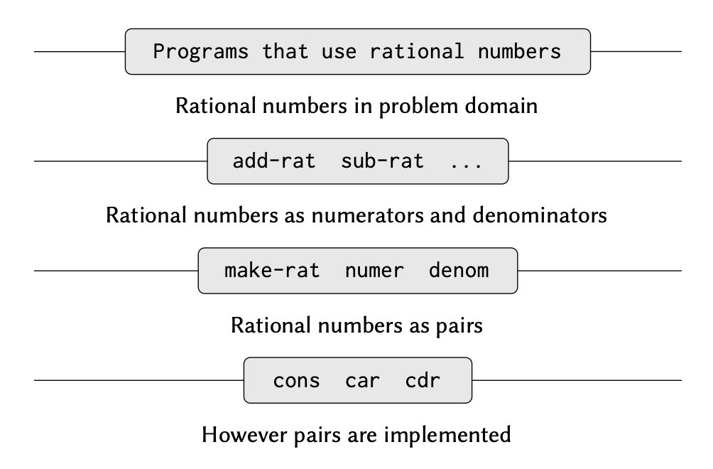

우리는 지금까지 `computational processes`와 `the role of procedures`에 대해 살펴봤다. `primitive data (numbers)`와 `primitive operations (arithmetic op-erations)`를 사용하는 방법도 살펴봤다. 또한, `composition`, `conditionals`, `parameters` 등을 이용하여 `procedures`를 결합해 `compound procedures`를 만들어보기도 했다. `define` 키워드를 이용하여 프로시저를 추상화(abstraction)하는 방법도 살펴봤다.

Procedure는 process가 진행되는 방식의 하나의 패턴으로 볼 수 있다. 우리는 이런 procedure들이 어떤 패턴을 가지는지 분류하고, 그것들을 어떻게 이해할 수 있는지 생각해 봤다. 그리고 간단한 알고리즘 분석도 해봤다. `higher-order procedures`가 계산을 더 일반적인 방식으로 다룰 수 있게 함으로써 프로그래밍 언어의 능력을 끌어 올려준다는 것을 보았다. 이런 것들이 결국 프로그래밍의 본질이다.

우리는 이 장에서 complex data를 어떻게 abstraction 할 수 있는지에 대해 공부한다. 앞서 간단한 수 데이터를 쓰는 것이 전부였지만, 단순한 데이터만 가지고 풀기 어려운 문제를 살펴볼 것이다.

프로그램은 복잡한 현상을 모델링하게 설계되며, 현실 세계의 다양한 측면을 모델링 하기 위해서는 여러 파트로 구성된 `computational objects`를 만들어야 한다. 우리가 앞서 procedure를 결합하여 compound procedure를 만드는 방식으로 추상화에 집중했다면 이번에는 데이터 객체(data object)를 결합하여 복합 데이터(compound data)를 만드는 방법에 대해 다룬다.

왜 프로그래밍 언어로 compound data를 나타내려고 할까? 이는 compound procedure가 필요한 이유와 동일하다. 모듈식으로 프로그램을 설계하는 데 도움이 될 뿐만 아니라, 언어의 표현력을 끌어올릴 수 있다.

# Introduction to Data Abstraction

한 프로시저가 더 복잡한 프로시저의 일부일 때, 그 프로시저는 여러 연산을 묶어 놓은 것 뿐만 아니라, 프로시저를 추상화하여 그 내용을 감추는 것으로 볼 수도 있다. 그 말은 프로시저를 어떻게 만들었던 간에 동일한 일을 수행하는 다른 프로시저가 있다면 맞바꿔 사용할 수 있다는 말이다.

compound data에 대해 이와 유사한 개념을 데이터 추상화(data abstraction)라고 한다.

데이터 추상화(data abstraction)는 복합 데이터 객체(compound data object)의 사용 방식과, 그것이 보다 기본적인 데이터 객체(primitive data objects)로부터 구성되는 방식을 분리할 수 있도록 하는 방법론이다.

데이터 추상화의 기본 개념은, 복합 데이터 객체를 사용하는 프로그램이 "추상적 데이터(abstract data)"를 다루도록 구조화하는 것이다. 즉, 프로그램이 데이터를 사용할 때, 내부적으로 어떻게 구현되었는지는 신경 쓰지 않고, 필요한 기능만 사용하면 된다.

이를 위해, 실제 데이터를 다루는 방식(구체적 표현)과 프로그램이 데이터를 사용하는 방식(추상적 데이터)을 나누고, 이 둘을 연결하는 `constructors`와 `selectors`를 사용할 수 있다.

## Example: Arithmetic Operations for Rational Numbers

> 연습: 유리수를 위한 산술 연산

정수나 실수 외에도 유리수를 연산해야 한다고 하자. 유리수에 대한 덧셈, 뺄셈, 곱셈, 나눗셈은 물론이고 두 유리수가 같은지 알아보는 연산이 있어야 한다.

> 분자: numerator / 분모: denominator

먼저, 분자와 분모로 유리수를 만드는 연산과 어떤 유리수에서 분자와 분모를 가져오는 연산이 있다고 하자. 더 나아가 `constructor`와 `selector`가 프로시저로 정의되어 있다고 하자.

- `(make-rat<n> <d>)` 분자가 n이고 분모가 d인 유리수를 만든다.
- `(numer <x>)` 유리수 x의 분자를 가져온다.
- `(denom <x>)` 유리수 x의 분모를 가져온다.

우선 `number`, `denom`, `make-rat`의 내부 동작을 따져보지 말자. 위 3개의 프로시저만 있으면 유리수의 덧셈, 뺄셈, 곱셈, 나눗셈, 두 유리수가 같은지를 알아보는 연산을 만들 수 있다.

```markdown
n1/d1 + n2/d2 = (n1d2 + n2d1)/d1d2

n1/d1 - n2/d2 = (n1d2 - n2d1)/d1d2

n1/d1 \* n2/d2 = n1n2/d1d2

n1/d1 / n2/d2 = n1d2/d1n2

n1/d1 = n2/d2라면, n1d2 = n2d1이다.
```

위 규칙을 프로시저로 옮겨 쓰면 다음과 같다.

```scheme
(define (add-rat x y)
  (make-rat (+ (* (numer x) (denom y))
               (* (numer y) (denom x)))
            (* (denom x) (denom y))))

(define (sub-rat x y)
  (make-rat (- (* (numer x) (denom y))
               (* (numer y) (denom x)))
            (* (denom x) (denom y))))

(define (mul-rat x y)
  (make-rat (* (numer x) (numer y))
            (* (denom x) (denom y))))

(define (div-rat x y)
  (make-rat (* (numer x) (denom y))
            (* (denom x) (numer y))))

(define (equal-rat? x y)
  (= (* (numer x) (denom y))
     (* (numer y) (denom x))))
```

위 연산을 만들 때 쓴 `numer`, `denom`, `make-rat` 연산은 아직 정의하지 않았다. 이러한 프로시저를 짜려면 분자와 분모를 하나로 만들어 유리수를 표현할 수 있는 수단이 필요하다.

### Pairs

데이터를 잘 추상화해서 그에 딱 맞게 사용하기 위해 우리는 _pair_ 즉, 쌍이라는 compound structure를 사용한다.

쌍은 `cons`라는 primitive procedure를 사용하여 생성할 수 있다. 이 프로시저는 두 개의 argument를 받아서 하나의 compound data object를 반환한다. 쌍이 주어지면 `car` 와 `cdr` 이라는 primitive procedure를 사용하여 각각의 부분을 추출할 수 있다.

```scheme
(define x (cons 1 2))

(car x)
>
1

(cdr x)
>
2
```

쌍(pair)은 기본 데이터 객체(primitive data object)처럼 이름을 부여하고 조작할 수 있는 데이터 객체이다.

또한, `cons`를 사용하여 요소가 또 다른 쌍인 쌍을 만들 수도 있으며, 이를 반복하여 계속 중첩된 구조를 형성할 수도 있다.

```scheme
(define x (cons 1 2))

(define y (cons 3 4))

(define z (cons x y))

(car (car z))
>
1

(car (cdr z))
>
3
```

나중에는 Pair로 여러 가지 복잡한 데이터 구조를 만들 수 있다는 걸 배울 거다.

`cons`, `car`, `cdr` procedure을 사용하여 구현된 쌍(pair) 이라는 단 하나의 복합 데이터 기본 요소(compound-data primitive) pair가 우리가 필요한 유일한 기본 데이터 구조다.

데이터를 다룰 때, 쌍(pair)만 있으면 리스트나 트리 같은 구조도 만들 수 있다. 쌍을 조합해서 만든 데이터들을 리스트 구조 데이터(list-structured data) 라고 부른다.

### Representing rational numbers

쌍을 사용하면 유리수 시스템을 자연스럽게 완성할 수 있다. 유리수는 분자와 분모를 나타내는 두 정수의 쌍으로 쉽게 나타낸다. 이에 따라 `make-rat`, `numer`, `denom`을 다음과 같이 표현할 수 있다.

```scheme
(define (make-rat n d) (cons n d))

(define (numer x) (car x))

(define (denom x) (cdr x))
```

계산 결과를 나타낼 때는 다음과 같이 "분자 / 분모" 차례로 유리수를 찍어내는 프로시저를 만들 수 있다.

```scheme
(define (print-rat x))
  (newline)
  (display (numer x))
  (display "/")
  (display (denom x))
```

잘 돌아가는지 확인해보자.

```scheme
(define one-half (make-rat 1 2))
(print-rat one-half)
>
1/2

(define one-third (make-rat 1 3))
(print-rat (add-rat one-half one-third))
>
5/6

(print-rat (mul-rat one-half one-third))
>
1/6

(print-rat (add-rat one-third one-third))
>
6/9
```

마지막 예제의 결과(6/9)를 보면 기약분수가 아니다. 이 문제를 해결하려면 `make-rat`을 고쳐야 한다. 최대 공약수를 구하는 `gcd` 프로시저를 사용하여 분자와 분모를 최대공약수로 만들어 기약분수를 만든 후에 쌍으로 만들자.

```scheme
(define (make-rat n d)
  (let ((g (gcd n d))))
    (cons (/ n g) (/ d g)))

; gcd를 통해 n, d에 대한 최대공약수 g를 구하고 이를 n과 d로부터 나눠서 pair를 만듬.
```

```scheme
(print-rat (add-rat one-third one-third))
>
2/3
```

유리수 연산하는 프로시저에는 손을 대지도 않고 `make-rat` 프로시저만 고쳤다는 것을 기억해두자.

## Abstraction Barriers

앞서 `make-rat`이라는 constructor와 `numer`, `denom`이라는 selector로 유리수를 정의했다.

일반적으로, 데이터 추상화(data abstraction)의 기본 개념 은 각 데이터 객체 유형마다 해당 유형의 모든 조작을 표현할 수 있는 **기본 연산의 집합**을 정의하는 것이다.

그리고 데이터를 조작할 때는 이 **기본 연산들만 사용**하도록 하는 것이 데이터 추상화의 핵심이다.

예를 들어, 리스트라는 데이터를 만든다면,

- 리스트를 만드는 연산 (예: `cons`)
- 리스트에서 값을 가져오는 연산 (예: `car`, `cdr`)

이렇게 몇 가지 기본 기능만 정해서 사용하면, 내부 구현이 바뀌더라도 프로그램이 잘 동작할 수 있다.



위 그림에서 가로 선은 *abstraction barrier*라고 하는데 나눠진 기능들이 시스템에서 서로 다른 "level"에 있다는 것을 나타낸다.

각 level에서 abstraction barrier는 데이터 추상화를 사용하는 프로그램(위쪽)과 데이터를 추상화하는 방법을 구현하는 프로그램(아래쪽)을 분리한다.

유리수를 다루는 프로그램은 오직 유리수 패키지가 제공하는 "for public use"(`add-rat`, `sub-rat`, `mul-rat`, `div-rat`, `equal-rat?`)를 통해서만 유리수를 조작한다.

이 프로시저들은 다시 constructor와 selector인 `make-rat`, `numer`, `denom`을 이용해 구현되며, 이들 또한 쌍(pair)을 이용하여 구현된다.

쌍이 어떻게 구현되는지는 유리수 패키지의 그 이외의 부분에 대해서는 알 필요가 없다.

쌍을 다루는 데 필요한 `cons`, `car`, `cdr`만 있으면 되기 때문이다.

실제로 각 수준에서의 procedure는 abstraction barrier를 정의하고 서로 다른 수준들을 연결하는 "인터페이스" 역할을 한다.

## What Is Meant by Data?

데이터는 무엇인가?

"selector와 constructor로 구현된 것" 이렇게만 말하는 것으로는 충분하지 않다.

유리수에서는 정수 n과 d의 쌍으로 만든 유리수 x가 numer를 denom으로 나눈 값이 n을 d로 나눈 값과 같다는 조건을 만족해야 한다. 다시 말해서 어떤 정수 n과 0이 아닌 정수 d를 가지고 `(make-rat n d)`를 계산한 결과가 x이면 `make-rat`, `numer`, `denom`은 다음을 만족해야 한다.

```markdown
(numer x)/(denom x) = n/d
```

유리수라는 데이터를 만드는 데에는 `make-rat`, `numer`, `denom`이 만족해야 할 조건은 이것뿐이다. 흔히 데이터란, constructor, selector의 집합으로 정의된 것으로 생각할 수 있다. 이 프로시저가 제대로 동작하기 위해서는 유효하게 동작하기 위한 조건들이 같이 충족이 되어야 한다.

이런 시야로 "데이터" 라는 것을 바라보면 우리는 높은 수준의 물체 뿐만 아니라 그보다도 낮은 수준의 물체까지도 정의할 수 있다.

유리수를 만들 때 사용한 쌍의 개념을 살펴보자. `cons`, `car`, `cdr` 같은 프로시저만 써서 쌍을 다룰 수 있다고 했지, 쌍이 "무엇"이라고 말한 적은 없다. 하지만, `cons`로 두 물체를 하나로 조합한다면 `car`, `cdr`로 물체를 select 할 수 있다는 점은 기억해두자.

결국, `(cons x y)`는 `(car z)`의 결과는 x, `(cdr z)`의 결과는 y라는 조건을 만족해야 한다.

```scheme
(define (cons x y)
  (define (dispatch m)
    (cond ((= m 0) x)
          ((= m 1) y)
          (else (error "Argument not 0 or 1 -- CONS"))))
  dispatch)

(define (car z) (z 0))

(define (cdr z) (z 1))
```

이렇게 데이터를 프로시저로 나타내면 이를 바로 데이터라고 생각하기 어렵다. 그럼에도 이 프로시저 셋이 위에서 말한 조건을 만족하기만 하면 아무런 문제가 없다.

쌍이라는 데이터를 쓸 때 `cons`, `car`, `cdr`과 같은 인터페이스로만 쓴다면 "진짜" 데이터 구조를 써서 만든 쌍하고 프로시저로 만든 쌍하고 구분하지 못한다.

쌍을 프로시저로 표현한다는 것이 이상해 보일 수 있지만 쌍이 갖춰야 할 조건을 만족했기 때문에 흠잡을 데 없는 방법이다.

## 정리

"데이터"의 정확한 정의

- `constructor`와 `selector`로 정의되는 것: 어떻게 만들고, 어떻게 꺼낼지가 정해지는 것이 데이터
- 추상화의 대상: 내부 구현(cons 같은)이 아니라, 외부에서 보이는 동작과 의미가 중요
- 정보의 표현: 숫자, 리스트, 심볼 등 프로그래밍으로 다룰 수 있는 모든 형태 포함.
